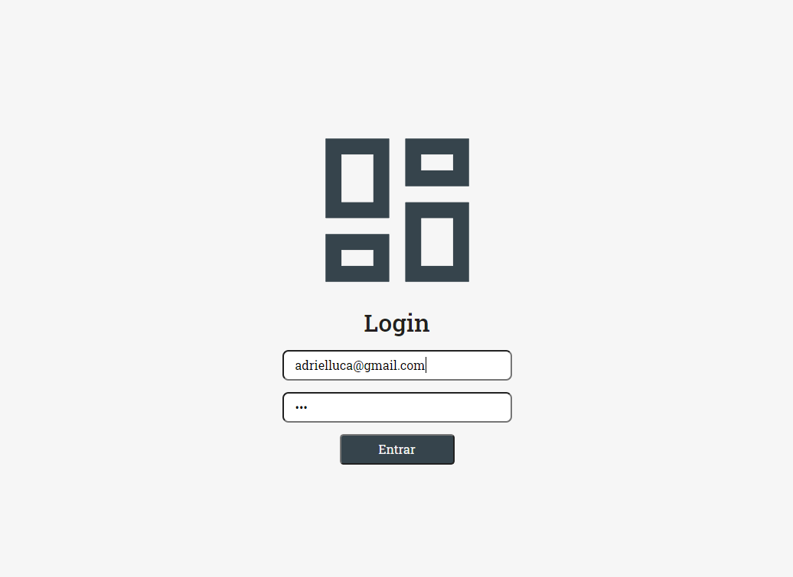
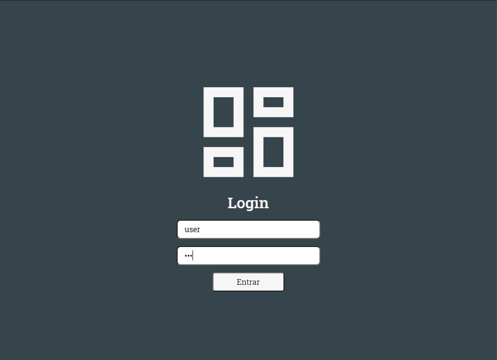
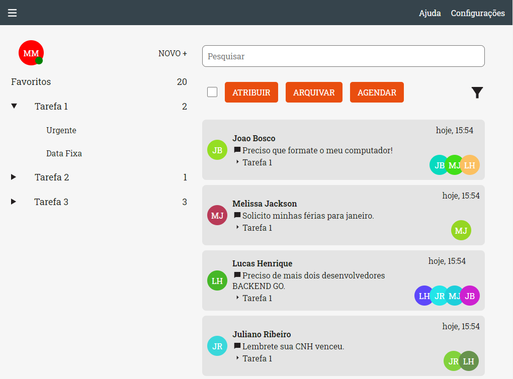
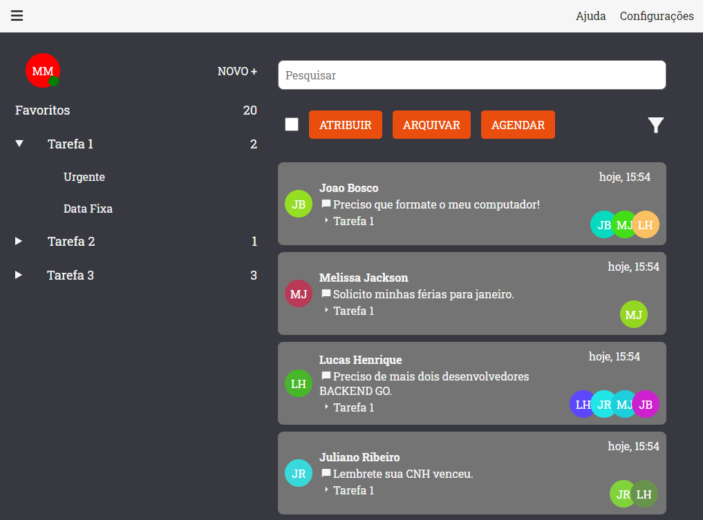

# Projeto de Dashboard

## Introdução
O Projeto é um dashboard que contem um login simples e que consulta uma api, listando as informações para ser manipulado.

# Ferramentas utilizadas

### React.Js
Biblioteca JavaScript para criar interfaces de usuário em páginas web.
### Typescript
Linguagem usada para tipar o codigo para ajudar na manipulação das variaveis e dependencias.
### EsLint
Utilizada para análisar o código para identificar padrões problemáticos encontrados no código JavaScript fazendo que o código esteja sempre obedecendo as regras de padrão impostas.
### Prettier
Responsável por formatar o código de acordo com as regras do EsLint.
### EditConfig
É um padronizador de editor de texto.
### Styled-Components
Biblioteca que permite escrever códigos CSS dentro do JavaScript.
### React-Router-Dom
Biblioteca usada para a navegação entre as  telas.
### React-Icons
Biblioteca usada para os icones em svg.
### Axios
Cliente HTTP utilizado para fazer as requisições Ajax.
### Json-Server
Biblioteca que cria uma API fake apenas com dados JSON.
### Json Web Token
Biblioteca de encriptação usada para armazenar o token

# Iniciando o Projeto

### Clone ou baixe o projeto para o seu computador

### `yarn start` ou `npm start` na pasta do projeto
Preferencial = 'yarn start'.
Necessário ter Node >= 8.10 e npm >= 5.6 na sua máquina.

Com isso o projeto irá rodar em modo de desenvolvimento.
Para visualizar o projeto abra o [http://localhost:3000] dentro do seu browser.

### Emulando a API
Rode a api com o comando `yarn server` no seu terminal.

As informações da api foram tiradas dos seguintes links :
...
...
pois o servidor não estava com a politica do CORS aceitando requisições localhost.

# Usando a aplicação
A primeira página será um login.

As credenciais de acesso são:
'user' e '123', respectivamente.

# Funções

* Login
* Mudar tema (Dark | Light)
* Listar Tarefas
* Armazenar Tarefas selecionadas

# Prints

### Tela de Login

### Tela de Login Dark

### Tela do Dashboard

### Tela do Dashboard Dark

